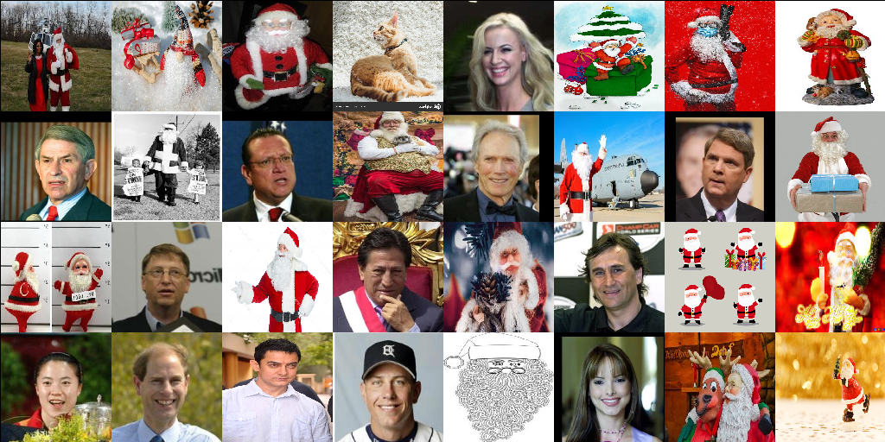
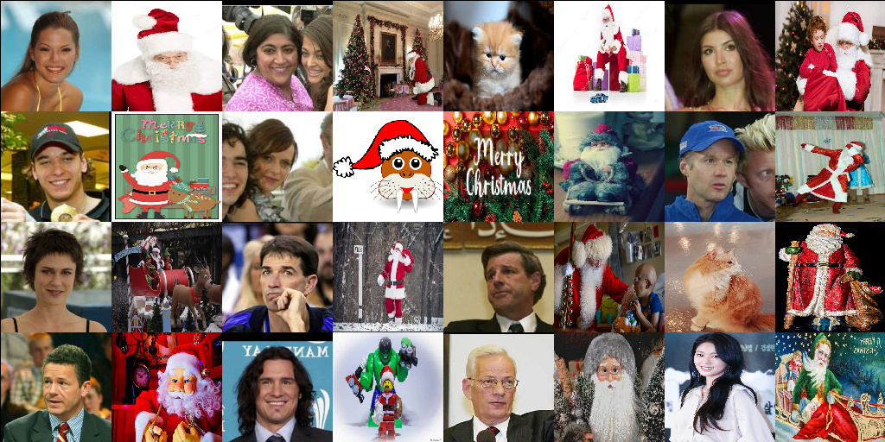
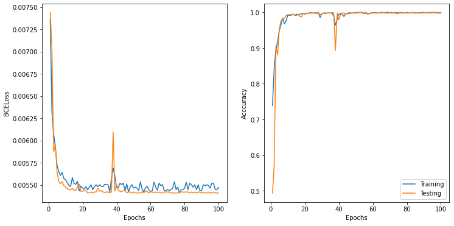
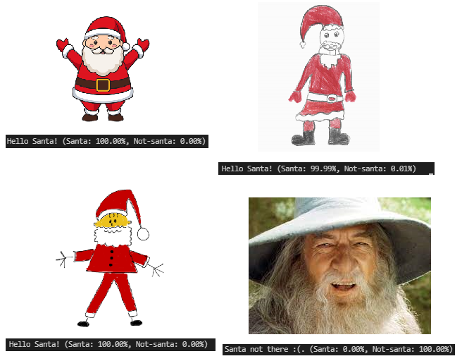
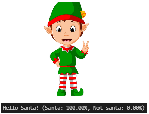

# Is that Santa?


## About
Santa classfifier for the Kaggle challenge: [Kaggle](https://www.kaggle.com/deepcontractor/is-that-santa-image-classification)

The task is to train a classfier to classify pictures where santa is present or not.

Some training samples:


Some testing samples:


## Installation
1. Clone the repository ``` git clone https://github.com/raulorteg/is_that_santa```
2. Create virtual environment:
* Update pip ``` python -m pip install pip --upgrade ```
* Install ``` virtualenv ``` using pip ``` python -m pip install virtualenv ```
* Create Virtual environment ``` virtualenv is_that_santa ```
* Activate Virtual environment (Mac OS/Linux: ``` source is_that_santa/bin/activate ```, Windows: ``` is_that_santa\Scripts\activate ```)
* (_Note: to deactivate environemt run ``` deactivate ```_)
3. Install requirements on the Virtual environment ``` python -m pip install -r requirements.txt ```
4. Create the directory structure ``` python setup_directories.py ```

## Usage
_For training the model:_
1.  Create .txt dataset for training set (e.g ```python create_db.py --path_imgs="datasets/train" --name_db="train_dataset.txt"```)
2.  Create .txt dataset for testing set (e.g ```python create_db.py --path_imgs="datasets/test" --name_db="test_dataset.txt"```)
3. Train the model (e.g ```python main.py --n_epochs=100 --lr=0.0001 --batch_size=32 --latent_size=100 --resize=128 --val_freq=1```)
4. Generate training plots (e.g ```python create_plots.py --path="results/results.txt"```)

_or automatically, to replicate shown results:_
1. Execute the shell script ```sh run_all.sh```

_to use a trained model on new images:_
1. Drop the images in the ```external\``` directory
2. Predict for the samples in the ```external\``` folder (e.g ```python is_that_santa.py```)

## Results
_to reproduce these results:_
1. Execute the shell script ```sh run_all.sh```



## Out of dataset samples (external)

Classified right:



Apparently it can be fooled with an elf:



